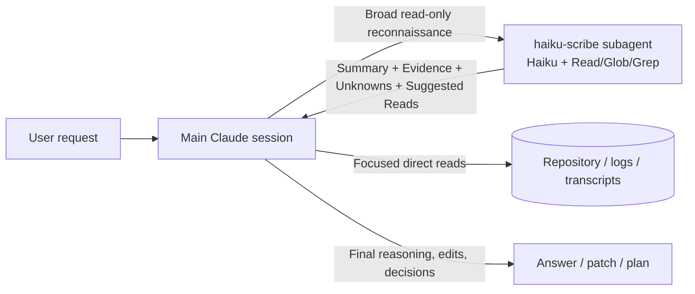

<p align="center">
  <picture>
    
  </picture>
</p>

# Haiku Scribe

Haiku Scribe is a personal Claude Code installer for a read-only, Haiku-powered
context compression subagent.

The subagent handles broad repository reconnaissance: reading, searching,
mapping, and compressing files, logs, transcripts, generated output, and related
context into a compact evidence brief. The main Claude session keeps the work
that needs stronger reasoning: debugging conclusions, architecture decisions,
security judgments, edits, commits, and user-facing summaries.

Haiku Scribe is not a fixer, coding agent, or subagent team. It is a scout.

## Status

Current package version: `0.1.0`

The repository now contains a working Python CLI with the V1 personal installer
flow:

```bash
haiku-scribe setup
haiku-scribe setup --dry-run
haiku-scribe doctor
haiku-scribe uninstall
haiku-scribe uninstall --dry-run
```

The CLI installs Haiku Scribe into the current user's Claude Code configuration
under `~/.claude`. It does not currently install per project via a public
`--project` flag, and it is not packaged as a Claude Code plugin.

The implementation includes:

- a generated `~/.claude/agents/haiku-scribe.md` subagent;
- a managed Haiku Scribe guidance block in `~/.claude/CLAUDE.md`;
- merged read-deny rules in `~/.claude/settings.json`;
- V1.2 prompt nudge hooks under `~/.claude/hooks/`, with a size-gated fallback for very large direct reads;
- ownership metadata for deny rules and V1.2 hook entries;
- backups before mutating existing Claude Code files;
- dry-run support for setup and uninstall;
- `doctor` checks for missing files, unsafe agent drift, missing guidance, missing deny rules, and V1.2 hooks;
- focused pytest coverage for setup, doctor, uninstall, settings merge,
  markdown block handling, the agent contract, and hook behavior.

Still out of scope:

- hard blocking of direct reads;
- prompt rewriting or enforcement loops;
- team or global rollout;
- Claude Code plugin packaging;
- enterprise-managed controls;
- MCP or CodeGraph access inside the base `haiku-scribe` agent.

## Why It Exists

Claude Code is strong at solving problems, but a lot of context spend happens
before problem solving starts:

- reading too many files during orientation;
- opening large files just to understand their shape;
- dumping logs or transcripts into the main context;
- tracing flows across files before knowing where useful evidence is;
- asking a stronger model to do low-value reconnaissance.

Haiku Scribe splits that workflow:

1. Haiku Scribe scouts with read-only tools.
2. It returns a compact evidence brief with uncertainty and suggested reads.
3. The main Claude session directly verifies the important locations.
4. The main Claude session decides, edits, commits, and summarizes.

## How It Works



| Responsibility | Haiku Scribe | Main Claude session |
| --- | --- | --- |
| Bulk file orientation | Yes | Only when needed |
| Large file summarization | Yes | Verify focused sections |
| Log or transcript compression | Yes, with caution | Validate before relying on it |
| Evidence extraction | Yes | Verify and interpret |
| Root-cause conclusion | No | Yes |
| Architecture decision | No | Yes |
| Security/auth conclusion | No | Yes |
| File edits | No | Yes |
| Shell commands | No | Yes, when allowed |
| MCP / CodeGraph | No in base agent | Optional outside base agent |

## Installation

This repository is currently intended for local development or personal use from
source.

```bash
git clone https://github.com/RemyLespagnol/haiku-scribe.git
cd haiku-scribe
python3 -m venv .venv
source .venv/bin/activate
python -m pip install -e .
```

Then install the Claude Code configuration:

```bash
haiku-scribe setup --dry-run
haiku-scribe setup
haiku-scribe doctor
```

`setup` writes or updates:

```text
~/.claude/agents/haiku-scribe.md
~/.claude/CLAUDE.md
~/.claude/settings.json
~/.claude/hooks/haiku-scribe-v1-2-nudge.py
```

When existing files need to change, backups are written under:

```text
~/.claude/backups/haiku-scribe/
```

## Uninstall

Preview removals first:

```bash
haiku-scribe uninstall --dry-run
```

Then remove Haiku Scribe-owned content:

```bash
haiku-scribe uninstall
```

Uninstall removes the managed agent file, removes the owned block from
`~/.claude/CLAUDE.md`, removes only deny rules tracked in Haiku Scribe ownership
metadata, and removes Haiku Scribe backups. User content outside those owned
regions is preserved.

If `settings.json` is malformed during uninstall, Haiku Scribe leaves it alone
and still removes the other owned files it can handle safely.

## Agent Contract

The installed agent is generated from `src/haiku_scribe/contracts.py` and keeps
the base contract intentionally small:

```yaml
name: haiku-scribe
model: haiku
tools: Read, Glob, Grep
```

It may:

- read files requested by the main Claude session;
- search repository text using exact patterns;
- list files using glob patterns;
- summarize large files, logs, transcripts, generated output, and related files;
- extract evidence with file paths and line numbers when available;
- identify uncertainty and recommend focused direct reads.

It must not:

- edit files;
- write files;
- run shell commands;
- browse the web;
- use MCP tools;
- invoke other agents;
- make final root-cause conclusions;
- make final architecture decisions;
- make final security, authentication, authorization, or permission conclusions;
- produce final PR summaries, commit messages, release notes, or public project
  outputs.

## Safety Settings

`setup` merges these read-deny rules into `~/.claude/settings.json`:

```text
Read(./.env)
Read(./.env.*)
Read(./secrets/**)
Read(./config/credentials.json)
Read(**/*.pem)
Read(**/*.key)
Read(**/*secret*)
Read(**/*credential*)
```

Rules already present are preserved and not duplicated. New rules added by
Haiku Scribe are tracked under `haiku_scribe.owned_deny_rules` so uninstall can
remove only content it owns.

## When To Use It

Use Haiku Scribe before the main Claude session loads broad raw context.
Do not delegate and then re-read the same raw source broadly; either ask for a
structured extraction that is useful enough to continue, or read directly when
exact line-level detail is the real task.

Good delegation triggers:

- "Map relevant files before we debug this."
- "Summarize this large file without recommendations."
- "Compress this log or transcript into decisions, evidence, and unknowns."
- "Find where this flow starts and which files I should inspect directly."
- "Extract evidence first; do not make the final scope decision."
- "Give me compact orientation in this unfamiliar area."

Do not delegate when:

- the main session needs exact edit context immediately;
- the task involves three or fewer small known files;
- the task requires final diagnosis or final architecture judgment;
- the task is security, authentication, authorization, or permission-sensitive;
- the user explicitly asks the main Claude session to inspect exact content;
- content appears secret-bearing and the user has not explicitly asked for it to
  be inspected.

## Example Prompt

```text
Use the haiku-scribe subagent to map relevant files for this issue before you
read them directly. Return Summary, Evidence, Unknowns And Risks, and Suggested
Direct Reads. Do not make final conclusions.
```

Expected response shape:

```text
## Summary
- Two to six bullets with the compressed answer.

## Evidence
- path/to/file.ext:line: Relevant observed fact.

## Unknowns And Risks
- Missing context, ambiguity, or confidence limits.

## Suggested Direct Reads
- path/to/file.ext:line: Why the main Claude session should inspect this exact
  location.
```

## Development

Run tests:

```bash
python -m pytest
```

Project layout:

```text
src/haiku_scribe/
  cli.py              CLI entrypoint and subcommands
  contracts.py        Generated agent markdown, guidance block, deny rules
  setup.py            Personal install flow
  doctor.py           Installation and safety checks
  uninstall.py        Bounded removal flow
  settings.py         Safe settings merge and ownership tracking
  markdown_blocks.py  Managed CLAUDE.md block helpers
  backups.py          Timestamped backups before mutation
  paths.py            ~/.claude path model

tests/                Pytest coverage for CLI behavior and helpers
bench/                Semi-manual navigation and CodeGraph benchmark workspace
docs/                 Product/design notes and evaluations
```

## Benchmarks

`bench/` contains semi-manual benchmark tasks and run records used to evaluate
context-routing ideas, especially whether CodeGraph reduces direct file reads
and large outputs enough to justify a separate graph-oriented worker.

Generate the current report with:

```bash
python3 bench/report.py
```

The base `haiku-scribe` agent remains MCP-free and CodeGraph-free until data
justifies changing that contract.

## Roadmap

| Version | Goal |
| --- | --- |
| V0 | Manual project-local `haiku-scribe` subagent workflow validation |
| V1 | Personal installer, doctor, uninstall, safe settings merge, backups, dry-run |
| V1.1 | Audit-only usage reporting, without changing Claude behavior |
| V1.2 | Optional prompt nudges when delegation would help |
| V1.3 | Soft enforcement experiments, only if nudges prove useful |
| V2 | Team/project rollout shared conventions |
| V3 | Claude Code plugin packaging |
| V4 | Enterprise-managed rollout controls |
| V5 | Optional MCP/CodeGraph experiments, kept out of the base agent until data justifies them |

## License

TODO: add a `LICENSE` file before wider reuse or distribution.
