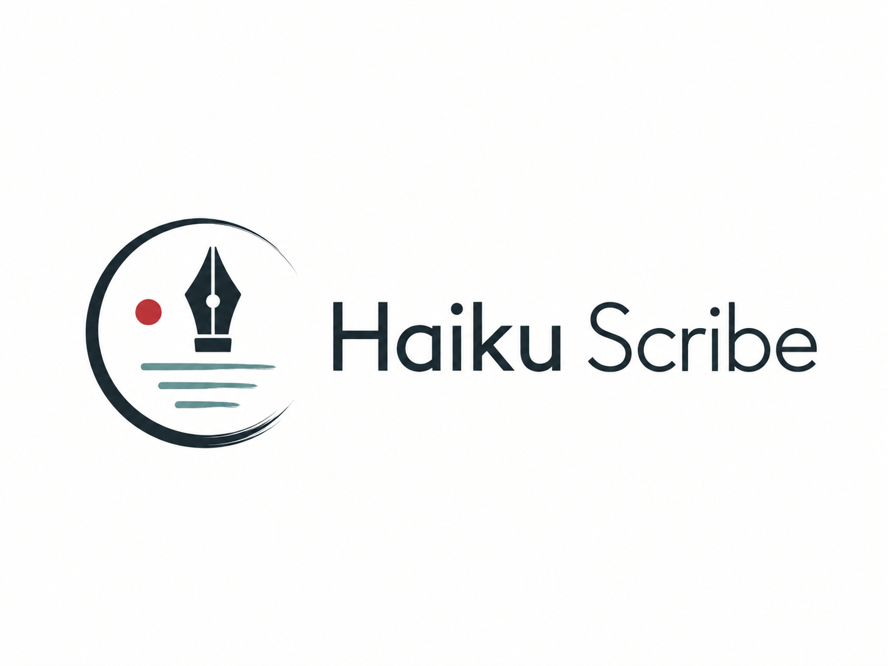
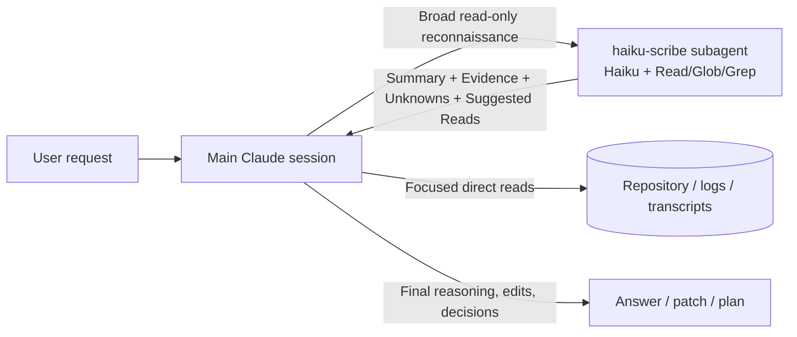

<p align="center">
  <picture>
    
  </picture>
</p>

> A read-only Haiku-powered context compression worker for Claude Code.

Haiku Scribe is a tiny project-local Claude Code subagent that handles the expensive, boring part of agentic coding: broad reading.

It reads, searches, maps, and compresses repository context, logs, transcripts, generated output, and related files into a compact evidence brief. The main Claude session keeps the important work: reasoning, debugging, editing, architecture decisions, security conclusions, commits, and public summaries.

Haiku Scribe is not another coding agent. It is not a fixer. It is not a subagent team. It is a scout.

---

## Status

**Current version: V0 — manual subagent validated with known limitations.**

The repository currently contains a manually installable Claude Code subagent:

```text
.claude/agents/haiku-scribe.md
```

V0 proved the core workflow: delegate broad read-only context gathering to Haiku, receive a compact evidence-oriented summary, then let the main Claude session perform focused verification and final reasoning.

**V1 starts here.** The next milestone is personal packaging around the validated agent:

* `setup`: install the agent safely into a Claude Code project;
* `doctor`: verify the installed agent and safety settings;
* `uninstall`: remove only what Haiku Scribe owns;
* safe configuration merge;
* dry-run mode;
* backups;
* bounded ownership markers;
* validation that the installed agent still matches the V0 safety contract.

Not in V1 base scope:

* hooks;
* prompt nudges;
* soft enforcement;
* team rollout machinery;
* Claude Code plugin packaging;
* enterprise-managed controls;
* MCP or CodeGraph access inside the base `haiku-scribe` agent.

---

## Why this exists

Claude Code is great at solving problems, but a lot of token spend happens before the actual solving starts:

* reading too many files for orientation;
* opening large files just to understand their shape;
* dumping logs or transcripts into the main context;
* tracing a flow across several files before knowing where the useful evidence is;
* asking a strong model to perform low-value reconnaissance.

Haiku Scribe exists to split that workflow:

1. **Haiku Scribe scouts.** It reads only what is needed and returns compressed evidence.
2. **Main Claude verifies.** It performs focused direct reads on the most relevant locations.
3. **Main Claude decides.** It keeps final reasoning, edits, and user-facing conclusions.

The goal is not to replace the main model. The goal is to stop spending premium context on raw orientation when a cheap read-only worker can prepare the map.

---

## How it works



The split is intentional:

| Responsibility             | Haiku Scribe      | Main Claude session             |
| -------------------------- | ----------------- | ------------------------------- |
| Bulk file orientation      | Yes               | Only when needed                |
| Large file summarization   | Yes               | Verify focused sections         |
| Log/transcript compression | Yes, with caution | Validate before relying on it   |
| Evidence extraction        | Yes               | Verify and interpret            |
| Root-cause conclusion      | No                | Yes                             |
| Architecture decision      | No                | Yes                             |
| Security/auth conclusion   | No                | Yes                             |
| File edits                 | No                | Yes                             |
| Shell commands             | No                | Yes, when allowed               |
| MCP / CodeGraph            | No in base agent  | Optional outside the base agent |

---

## The agent contract

The current V0 agent is deliberately small:

```yaml
name: haiku-scribe
model: haiku
tools: Read, Glob, Grep
```

It may:

* read files requested by the main Claude session;
* search repository text using exact patterns;
* list files using glob patterns;
* summarize large files, logs, transcripts, generated output, and related files;
* extract evidence with file paths and line numbers when available;
* identify uncertainty and recommend focused direct reads.

It must not:

* edit files;
* write files;
* run shell commands;
* browse the web;
* use MCP tools;
* invoke other agents;
* make final root-cause conclusions;
* make final architecture decisions;
* make final security, authentication, authorization, or permission conclusions;
* produce final PR summaries, commit messages, release notes, or public project outputs.

---

## When to use Haiku Scribe

Use it before the main Claude session loads broad raw context.

Good delegation triggers:

* “Map the relevant files before we debug this.”
* “Summarize this large file without making recommendations.”
* “Compress this noisy log/transcript into decisions, evidence, and unknowns.”
* “Find where this flow starts and which files the main session should inspect.”
* “Extract evidence first; do not make the final scope decision.”
* “Give me a compact orientation of this unfamiliar area.”

Do not delegate when:

* the main session needs exact edit context immediately;
* the file is small and clearly the file to edit;
* the task requires final diagnosis or final architecture judgment;
* the task is security/auth/permission-sensitive;
* the user explicitly asks the main Claude session to inspect exact content;
* the content appears secret-bearing and the user has not explicitly asked for it to be inspected.

---

## Quick start — V0 manual usage

Until V1 packaging exists, install the agent manually.

### 1. Clone this repository

```bash
git clone https://github.com/RemyLespagnol/haiku-scribe.git
cd haiku-scribe
```

### 2. Copy the agent into a Claude Code project

From the project where you want to use Haiku Scribe:

```bash
mkdir -p .claude/agents
cp /path/to/haiku-scribe/.claude/agents/haiku-scribe.md .claude/agents/haiku-scribe.md
```

Or, if you are testing directly inside this repository, the agent is already present at:

```text
.claude/agents/haiku-scribe.md
```

### 3. Restart or reopen Claude Code in the target project

Then ask Claude Code to delegate explicitly:

```text
Use the haiku-scribe subagent to map the relevant files for this issue before you read them directly.
Return Summary, Evidence, Unknowns And Risks, and Suggested Direct Reads.
Do not make final conclusions.
```

### 4. Verify the handoff

A useful Haiku Scribe response should give the main Claude session:

* a compact summary;
* concrete file-path evidence;
* uncertainty or risk notes;
* a short list of targeted direct reads.

The main session should then inspect only the suggested high-value locations before deciding or editing.

---

## Example prompts

### Repository orientation

```text
Use the haiku-scribe subagent to orient me in this repository area before reading files directly.
Find the likely entry points, related files, and the smallest set of direct reads needed for the main session.
Do not make implementation recommendations.
```

### Large file summary

```text
Use haiku-scribe to summarize this file's structure and responsibilities.
Return only facts, evidence, unknowns, and suggested direct reads.
Do not make final architecture conclusions.
```

### Debugging preflight

```text
Use haiku-scribe to extract evidence for this bug before root-cause analysis.
Map relevant files, observed facts, and suspicious areas.
Do not decide the root cause.
```

### Log or transcript compression

```text
Use haiku-scribe to compress this noisy transcript into key decisions, open questions, evidence, and suggested direct reads.
Do not make final conclusions.
Be explicit about uncertainty.
```

### Scope verification

```text
Use haiku-scribe to extract evidence for whether this feature is in scope.
Do not make the final scope decision.
Return the exact source locations the main session should verify.
```

---

## Expected response shape

Haiku Scribe should return a compact brief shaped like this:

```text
## Summary
- Two to six bullets with the compressed answer.

## Evidence
- path/to/file.ext:line: Relevant observed fact.

## Unknowns And Risks
- Any missing context, ambiguity, or confidence limit.

## Suggested Direct Reads
- path/to/file.ext:line: Why the main Claude session should inspect this exact location.
```

V0 discovered one known limitation: transcript/log compression is useful, but output formatting can vary. V1 should not solve this by making the agent prompt much larger. Prefer external validation, transcript extraction, report tooling, or golden tests around the agent instead.

---

## Repository layout

```text
.
├── .claude/
│   └── agents/
│       └── haiku-scribe.md        # V0 manual Claude Code subagent
├── bench/
│   ├── README.md                  # CodeGraph / agent navigation benchmark notes
│   ├── report.py                  # JSONL run report generator
│   ├── fixtures/                  # Small sample projects for repeatable tasks
│   ├── runs/                      # Semi-manual benchmark run records
│   └── tasks/                     # Benchmark task definitions
└── docs/
    └── superpowers/
        ├── specs/                 # Product/design specs
        └── evaluations/           # V0 manual workflow trial notes
```

---

## Benchmarking

The `bench/` directory is currently used for semi-manual evaluation of navigation workflows.

Generate a report:

```bash
python3 bench/report.py
```

The report aggregates run records by task and mode, including:

* average tool calls;
* average direct file reads;
* average large outputs;
* evidence count;
* found-right-area pass rate;
* edit-ready pass rate;
* context-cost distribution;
* optional token fields when runs are recorded from Claude transcripts.

The CodeGraph benchmark is experimental. Its purpose is to answer a product question, not to change the base agent contract prematurely:

> Does CodeGraph reduce direct file reads or large outputs enough to justify a separate graph-oriented worker, or does direct CodeGraph use by the main agent capture most of the value with less ceremony?

For now, the base `haiku-scribe` agent remains MCP-free and CodeGraph-free.

---

## V1 target behavior

V1 should make the validated V0 workflow easy and safe to install locally.

A good V1 implementation should support:

```bash
haiku-scribe setup --project /path/to/project --dry-run
haiku-scribe setup --project /path/to/project
haiku-scribe doctor --project /path/to/project
haiku-scribe uninstall --project /path/to/project
```

These command names are the target product surface for V1. They are not guaranteed to exist until V1 is implemented.

### V1 acceptance criteria

V1 is done when:

* `setup` installs `.claude/agents/haiku-scribe.md` into a chosen project;
* `setup --dry-run` shows planned changes without writing;
* existing Claude Code settings are preserved;
* safety deny rules are merged without deleting unrelated user settings;
* backups are created before mutation;
* ownership metadata makes uninstall bounded and safe;
* `doctor` detects missing, drifted, or unsafe installation state;
* `uninstall` removes only Haiku Scribe-owned files/settings;
* tests cover setup, doctor, uninstall, merge behavior, and drift detection;
* the installed agent still matches the V0 read-only contract.

### V1 non-goals

V1 should not introduce:

* auto-invocation hooks;
* prompt rewriting;
* enforcement loops;
* team or global rollout;
* plugin marketplace packaging;
* enterprise policy management;
* MCP or CodeGraph inside the base agent.

---

## Roadmap

| Version | Goal                                                                                     |
| ------- | ---------------------------------------------------------------------------------------- |
| V0      | Manual project-local `haiku-scribe` subagent and workflow validation                     |
| V1      | Personal installer, doctor, uninstall, safe config merge, backups, dry-run               |
| V1.1    | Audit-only usage reporting, without changing Claude behavior                             |
| V1.2    | Optional prompt nudges for when delegation would help                                    |
| V1.3    | Soft enforcement experiments, only if nudges prove useful                                |
| V2      | Team/project rollout with shared conventions                                             |
| V3      | Claude Code plugin packaging                                                             |
| V4      | Enterprise-managed rollout and controls                                                  |
| V5      | Optional MCP/CodeGraph experiments, kept out of the base agent until data justifies them |

---

## Design principles

1. **Small prompt, strong boundary.** The agent should stay compact and easy to audit.
2. **Read-only by default.** No edits, shell, web, MCP, or recursive agents in the base contract.
3. **Evidence over confidence.** Haiku Scribe prepares facts; the main session decides.
4. **Main model owns judgment.** Debugging, architecture, security, and public outputs stay with the main model.
5. **No fake precision.** If evidence is incomplete, say so.
6. **Packaging must be safer than manual copy.** V1 is only valuable if setup/uninstall are boring, reversible, and bounded.
7. **Measure before adding machinery.** Hooks, enforcement, MCP, and CodeGraph should be earned by benchmark results, not added because they are interesting.

---

## Development notes

This project is intentionally early. Treat the current repository as a product/design + validation workspace, not a polished CLI package.

Recommended V1 implementation order:

1. Define the install manifest and ownership model.
2. Implement safe file copy for `.claude/agents/haiku-scribe.md`.
3. Add dry-run output.
4. Add backup creation.
5. Add settings merge behavior.
6. Add `doctor` drift checks.
7. Add bounded `uninstall`.
8. Add tests around every mutation path.
9. Only then improve UX.

A future CLI should prefer boring, inspectable behavior over clever automation.

---

## License

TODO: add a `LICENSE` file before wider reuse or distribution.
