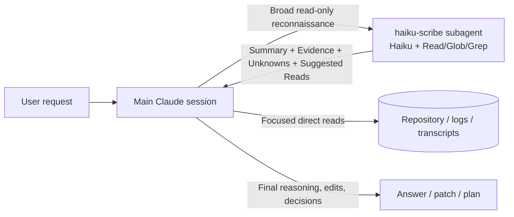

<p align="center">
  <picture>
    
  </picture>
</p>

# Haiku Scribe

[](./LICENSE)
[](./pyproject.toml)

Haiku Scribe is a personal installer for a read-only, Haiku-powered
"context compression" subagent for Claude Code.

The subagent handles broad repository reconnaissance — reading, searching,
mapping, and compressing files, logs, transcripts, and other generated
output into a compact evidence brief. The main Claude session keeps the
work that needs stronger reasoning: debugging conclusions, architecture
decisions, security judgments, edits, commits, and user-facing summaries.

Haiku Scribe is not a fixer, a coding agent, or a subagent team. It's a scout.

## Status

Current package version: `0.1.0`

This repository contains a working Python CLI (V1 personal installer flow):

```bash
haiku-scribe setup
haiku-scribe setup --dry-run
haiku-scribe doctor
haiku-scribe uninstall
haiku-scribe uninstall --dry-run
```

The CLI installs Haiku Scribe into the current user's Claude Code
configuration under `~/.claude`. It does not yet support per-project
installs via a public `--project` flag, and it is not packaged as a
Claude Code plugin.

The current implementation includes:

- a generated `~/.claude/agents/haiku-scribe.md` subagent;
- a managed Haiku Scribe guidance block in `~/.claude/CLAUDE.md`;
- merged read-deny rules in `~/.claude/settings.json`;
- opt-in V1.2 prompt-nudge hooks under `~/.claude/hooks/` (install with
  `setup --hooks on`; plain `setup` leaves them off and removes any
  previously installed ones), with a size-gated fallback for large direct
  reads;
- ownership metadata for the deny rules and V1.2 hook entries;
- backups before mutating any existing Claude config;
- dry-run previews for every mutating command.

Not yet implemented:

- prompt-rewriting enforcement loops;
- team or organization-wide rollout;
- Claude Code plugin packaging;
- enterprise-managed controls;
- MCP or CodeGraph access inside the base `haiku-scribe` agent.

## Why It Exists

Claude Code is strong at solving problems, but a lot of context gets spent
before problem solving even starts:

- reading too many files during orientation;
- opening large files just to understand their shape;
- dumping logs or transcripts into the main context;
- tracing flows across files before knowing where the useful evidence is;
- asking a stronger model to do low-value reconnaissance.

Haiku Scribe splits that workflow:

1. Haiku Scribe scouts with read-only tools.
2. It returns a compact evidence brief with uncertainty and suggested reads.
3. The main Claude session directly verifies the important locations.
4. The main Claude session decides, edits, commits, and summarizes.

## How It Works



| Responsibility                 | Haiku Scribe   | Main Claude session            |
| ------------------------------ | -------------- | ------------------------------- |
| Bulk file orientation          | Yes            | Only when needed                |
| Large file summarization       | Yes            | Verify focused sections         |
| Log or transcript compression  | Yes, with caution | Validate before relying on it |
| Evidence extraction            | Yes            | Verify and interpret            |
| Root-cause conclusion          | No             | Yes                             |
| Architecture decision          | No             | Yes                             |
| Security/auth conclusion       | No             | Yes                             |
| File edits                     | No             | Yes                             |
| Shell commands                 | No             | Yes                             |
| MCP / CodeGraph access         | No (base agent) | Optional                       |

## Installation

This repository is currently intended for local development and personal
use from source.

```bash
git clone https://github.com/RemyLespagnol/haiku-scribe.git
cd haiku-scribe
python3 -m venv .venv
source .venv/bin/activate
python -m pip install -e .
```

Requires Python 3.11+.

Install into your Claude Code configuration:

```bash
haiku-scribe setup --dry-run
haiku-scribe setup
haiku-scribe doctor
```

`setup` writes or updates:

```text
~/.claude/agents/haiku-scribe.md
~/.claude/CLAUDE.md
~/.claude/settings.json
~/.claude/hooks/haiku-scribe-v1-2-nudge.py   # only with --hooks on
```

When an existing file needs to change, a backup is written first, under:

```text
~/.claude/backups/haiku-scribe/
```

## Uninstall

Preview removals first:

```bash
haiku-scribe uninstall --dry-run
```

Remove all Haiku Scribe-owned content:

```bash
haiku-scribe uninstall
```

Uninstall removes the managed agent file, removes the owned block from
`~/.claude/CLAUDE.md`, removes only the deny rules and hook entries tracked
in Haiku Scribe's ownership metadata, and removes Haiku Scribe's backups.
User content outside those owned regions is preserved.

If `settings.json` is malformed at uninstall time, Haiku Scribe leaves it
alone and still safely removes its own files.

## Agent Contract

The installed agent, generated from `src/haiku_scribe/contracts.py`, keeps
a deliberately small base contract:

```yaml
name: haiku-scribe
model: haiku
tools: Read, Glob, Grep
```

It may:

- read files requested by the main Claude session;
- search the repository for text using exact patterns;
- list files matching a glob.

It may not:

- edit files, write files, or run shell commands;
- access the network, MCP servers, or CodeGraph;
- make final root-cause conclusions;
- make final architecture decisions;
- make final security, authentication, authorization, or permission
  conclusions;
- produce final PR summaries, commit messages, release notes, or other
  public project outputs.

## Safety Settings

`setup` merges read-deny rules into `~/.claude/settings.json`:

```text
Read(./.env)
Read(./.env.*)
Read(./secrets/**)
Read(./config/credentials.json)
Read(**/*.pem)
Read(**/*.key)
Read(**/*secret*)
Read(**/*credential*)
```

Rules already present are preserved and not duplicated. New rules added by
Haiku Scribe are tracked under `haiku_scribe.owned_deny_rules`, so uninstall
can remove only the content it owns.

## When To Use It

Use Haiku Scribe before the main Claude session loads broad raw context.
Don't delegate and then re-read the same raw source broadly — either ask
for a structured extraction that's useful enough to continue with, or read
directly when the task needs exact line-level detail.

Good delegation triggers:

- "Map the relevant files before we debug this."
- "Summarize this large file without recommendations."
- "Compress this log/transcript into decisions, evidence, and unknowns."
- "Find where the flow starts and which files I should inspect directly."
- "Extract evidence first; don't make the final scope decision."
- "Give me a compact orientation of this unfamiliar area."

Don't delegate when:

- the main session needs exact edit context immediately;
- the task involves three or fewer small, known files;
- the task requires a final diagnosis or final architecture judgment;
- the task is security, authentication, authorization, or
  permission-sensitive;
- the user explicitly asks the main Claude session to inspect the exact
  content;
- the content appears secret-bearing and the user hasn't explicitly asked
  for it to be inspected.

## Example Prompt

```text
Use haiku-scribe to map every file that touches the checkout flow and
summarize how payment status transitions. Do not make final conclusions.
```

Expected response shape:

```text
## Summary
- Two to six bullets with the compressed answer.

## Evidence
- path/to/file.ext:line — Relevant observed fact.

## Unknowns And Risks
- Missing context, ambiguity, confidence limits.

## Suggested Direct Reads
- path/to/file.ext:line — Why the main Claude session should inspect this
  exact location.
```

## Development

Run tests:

```bash
python -m pytest
```

Lint:

```bash
ruff check
```

Project layout:

```text
src/haiku_scribe/
    cli.py             CLI entrypoint and subcommands
    contracts.py       Generated agent markdown, guidance block, deny rules
    setup.py           Personal install flow
    doctor.py          Installation safety checks
    uninstall.py       Bounded removal flow
    settings.py        Safe settings merge and ownership tracking
    markdown_blocks.py Managed CLAUDE.md block helpers
    backups.py         Timestamped backups before mutation
    paths.py           ~/.claude path model

tests/  Pytest coverage for CLI behavior and helpers
bench/  Semi-manual navigation/CodeGraph benchmark workspace
docs/   Product and design notes/evaluations
```

## Benchmarks

`bench/` contains semi-manual benchmark tasks, runs, and records used to
evaluate context-routing ideas — in particular, whether CodeGraph reduces
direct file reads and large outputs enough to justify a separate
graph-oriented worker.

Generate the current report with:

```bash
python3 bench/report.py
```

The base `haiku-scribe` agent remains MCP-free and CodeGraph-free until
the data justifies changing that contract.

## Roadmap

| Version | Goal                                                                         |
| ------- | ----------------------------------------------------------------------------- |
| V0      | Manual project-local `haiku-scribe` subagent workflow validation             |
| V1      | Personal installer, doctor, uninstall, safe settings merge, backups, dry-run |
| V1.1    | Audit-only usage reporting, without changing Claude behavior                 |
| V1.2    | Optional prompt nudges when delegation would help                           |
| V2      | Team/project rollout                                                        |
| V4      | Enterprise-managed rollout controls                                         |
| V5      | Optional MCP/CodeGraph experiments, kept out of the base agent until data justifies them |

## License

MIT — see [LICENSE](./LICENSE).
